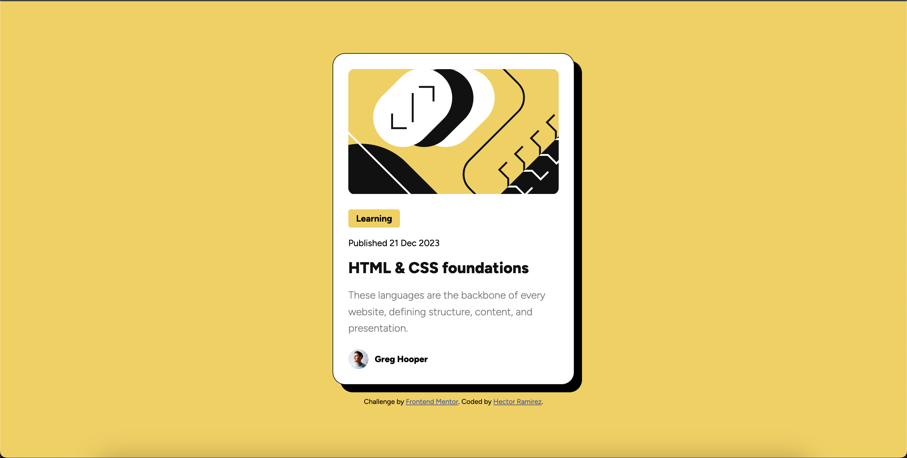

# Frontend Mentor - Blog preview card solution

This is a solution to the [Blog preview card challenge on Frontend Mentor](https://www.frontendmentor.io/challenges/blog-preview-card-ckPaj01IcS). Frontend Mentor challenges help you improve your coding skills by building realistic projects.

## Table of contents

- [Overview](#overview)
  - [The challenge](#the-challenge)
  - [Screenshot](#screenshot)
  - [Links](#links)
- [My process](#my-process)
  - [Built with](#built-with)
  - [What I learned](#what-i-learned)
  - [Continued development](#continued-development)
  - [Useful resources](#useful-resources)
- [Author](#author)

**Note: Delete this note and update the table of contents based on what sections you keep.**

## Overview

### The challenge

Users should be able to:

- See hover and focus states for all interactive elements on the page

### Screenshot



### Links

- Solution URL: [Add solution URL here](https://your-solution-url.com)
- Live Site URL: [Add live site URL here](https://your-live-site-url.com)

## My process

### Built with

- Semantic HTML5 markup
- CSS custom properties
- Flexbox
- Media Queries

### What I learned

I had fun coding the blog-preview-card. I learned how to properly use the calc() function in CSS. I used this to make my fonts more responsive on moblie. I also got more practice using media queries.

```css
.proud-of-this-css {
  font-size: calc(20px + (24 - 20) * ((100vw - 320px) / (1280 - 320)));
}
```

### Continued development

I want to continue practicing CSS, I need more practice making my web pages responsive to different sizes.

### Useful resources

- [Mdn](https://developer.mozilla.org/en-US/) - This helped me use media queries and learn more about the calc() function.
- [Stackoverflow](https://stackoverflow.com/) - This helped me find out how to make fonts more responsive using the calc() function.

## Author

- GitHub - [Hector Ramirez](https://github.com/hectorlil48)
- Frontend Mentor - [@hectorlil48](https://www.frontendmentor.io/profile/hectorlil48)
- LinkedIn - [@linkedin.com/in/hector-ramirez-6a6509170](https://www.linkedin.com/in/hector-ramirez-6a6509170/overlay/contact-info/)
